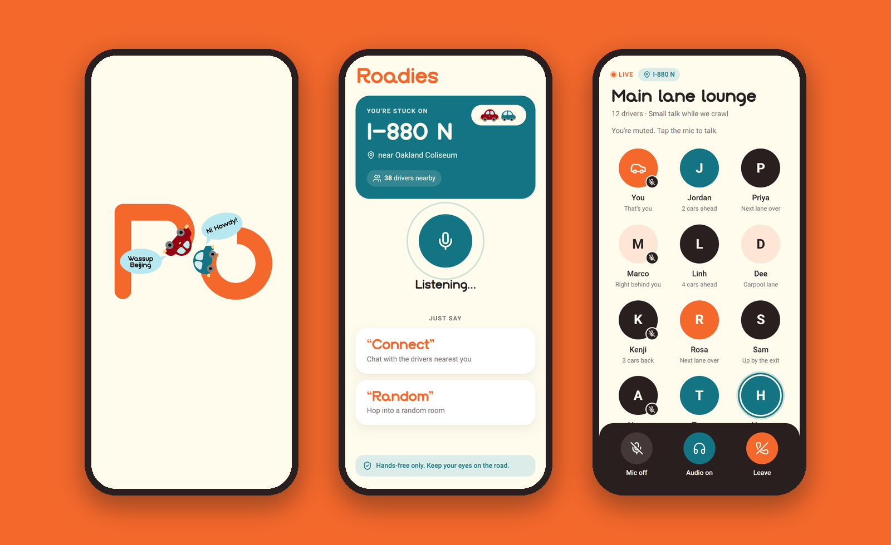

<p align="center">
  
</p>

<p align="center">
  <strong>Turn a traffic jam into a hangout.</strong><br>
  Hands-free voice chat for drivers stuck in the same jam.
</p>

<p align="center">
  <a href="https://roadies.afig.dev"></a>
  <a href="https://github.com/a-Fig/Roadies"></a>
  <a href="LICENSE"></a>
  
</p>

<p align="center">
  
</p>

> [!NOTE]
> This repository contains the Roadies **brand, animated logo intro, and frontend prototype**. The complete app, including the real-time backend, lives at **[a-Fig/Roadies](https://github.com/a-Fig/Roadies)** and runs at **[roadies.afig.dev](https://roadies.afig.dev)**.

## Contents

- [About](#about)
- [Features](#features)
- [The intro](#the-intro)
- [Getting started](#getting-started)
- [Voice commands](#voice-commands)
- [Project structure](#project-structure)
- [Design system](#design-system)
- [Connecting a backend](#connecting-a-backend)
- [Browser support](#browser-support)
- [Credits](#credits)
- [License](#license)

## About

Roadies is a social voice app for people stuck in traffic. Instead of staring at brake lights, you hop into a live voice room with the drivers around you, chat, joke around, and turn a dead-stopped commute into a hangout.

The people using it are driving, so Roadies is built to work without touching the phone: you join a room by saying a word, and the app answers out loud.

Roadies was created for the [ShowerHacks by EF](https://luma.com/99857qk9) hackathon. This repo holds the brand, the animated intro (built from the Figma storyboard), and a clickable frontend prototype that runs entirely on mock data.

## Features

- **Animated logo intro.** Two cars draw the "R" of the wordmark, pull in for a quick chat, and settle into the logo. It's one SVG canvas, so it stays sharp and perfectly aligned on every screen size.
- **Voice-first matching.** Say "Connect" to join the drivers nearest you, or "Random" for a surprise room. Roadies confirms out loud, so you never need to look.
- **Live voice room.** See who's in the room and who's talking, with controls for your mic, the room audio, and leaving.
- **Backend-ready.** Every server call goes through one small module with a documented contract. It's backed by mock data for now.
- **Responsive.** Full screen on phones from 320px wide, and a phone-sized frame on desktop.

## The intro

<p align="center">
  
</p>

The intro plays 1&nbsp;ms after the app opens, runs for about 3.4 seconds, then moves straight on to the next screen. Tapping skips it. It's built with [GSAP](https://gsap.com) and MorphSVG from frames 2–16 of the Figma storyboard; every layer's position, rotation, and shape for each frame lives in [`src/intro/frames.js`](src/intro/frames.js).

## Getting started

### Prerequisites

- [Node.js](https://nodejs.org) 20.19+ or 22.12+
- npm

### Install and run

```bash
git clone https://github.com/tthy-working/roadies.git
cd roadies
npm install
npm run dev
```

Then open [http://localhost:5173](http://localhost:5173).

| Command | What it does |
| --- | --- |
| `npm run dev` | Starts the dev server with hot reload |
| `npm run build` | Builds the production site into `dist/` |
| `npm run preview` | Serves the production build locally |

> [!IMPORTANT]
> Headings use the **Bepory** font, which is licensed for personal use only and can't be redistributed, so it isn't in this repo. To see it, install Bepory on your computer or place `Bepory.otf` in `public/fonts/` (that folder is git-ignored). Without it, headings fall back to Roboto. The logo and intro are vector outlines, so they look right either way. A commercial license is available from [Rantau Studio](https://rantaustudio.com/).

## Voice commands

After the intro, Roadies shows the road you're stuck on and listens:

| Say | What happens |
| --- | --- |
| **"Connect"** | Joins the voice room with the drivers nearest you |
| **"Random"** | Joins a random room |

The commands are also large buttons, for passengers and for browsers without speech recognition. Inside a room, the controls are:

| Control | What it does |
| --- | --- |
| **Mic** | Turns your microphone on or off. You join muted. |
| **Audio** | Connects or disconnects the room audio. Disconnecting also mutes you. |
| **Leave** | Leaves the room and returns to your jam. |

Voice commands use the browser's built-in [Web Speech API](https://developer.mozilla.org/docs/Web/API/Web_Speech_API). In Chrome, that audio is sent to Google's speech service to be transcribed.

## Project structure

```
roadies/
├── index.html                 App shell and the intro's SVG canvas
├── docs/                      README images and logo
└── src/
    ├── main.js                Start-up and screen transitions
    ├── intro/                 The animated logo intro
    │   ├── intro.js           GSAP timeline
    │   ├── frames.js          Keyframes from the Figma storyboard
    │   └── shapes.js          Outlined wordmark and speech-bubble paths
    ├── screens/
    │   ├── home.js            "Your jam": listens for Connect / Random
    │   └── room.js            The voice room and its controls
    ├── api/
    │   ├── roadies.js         Every backend call (mocked)
    │   └── mock.js            Sample jam, rooms, and people
    ├── lib/
    │   ├── voice-commands.js  Speech recognition and spoken confirmations
    │   ├── mic.js             Microphone capture and speaking detection
    │   ├── dom.js             Escaping, icons, toasts, avatar colors
    │   └── assets.js          Car illustrations
    └── styles/                Brand tokens (base.css) and one file per screen
```

## Design system

| | Color | Hex | Used for |
| --- | --- | --- | --- |
|  | Orange | `#F4682C` | Logo and main actions |
|  | Teal | `#137584` | Jam card, active controls, speaking ring |
|  | Cream | `#FFFCEE` | Backgrounds |
|  | Ink | `#2A1F1F` | Text and the controls bar |

| Typeface | Weights | Used for |
| --- | --- | --- |
| Bepory | Regular | Logo and headings |
| Roboto | 400, 500, 700 | Body text and interface |

All tokens are CSS custom properties in [`src/styles/base.css`](src/styles/base.css).

## Connecting a backend

The screens never talk to a server directly; everything goes through [`src/api/roadies.js`](src/api/roadies.js). To connect a real backend, replace these function bodies and keep the shapes they return (documented with JSDoc in the file):

| Function | Returns | Notes |
| --- | --- | --- |
| `getCurrentJam(coords)` | `Jam` | `coords` is the device location, or `null` if the user declined |
| `findVoiceChat(jamId, mode, coords)` | `VoiceChat` | `mode` is `"nearest"` ("Connect") or `"random"` ("Random") |
| `joinVoiceChat(chatId)` | `VoiceSession` | Open the socket and WebRTC connection here |

A `VoiceSession` exposes the people in the room (`participants`), events for joins and speaking (`on("participants")`, `on("speaking")`), and the controls (`setMicEnabled`, `setAudioConnected`, `leave`). `MockVoiceSession` in the same file is a complete working example.

For a production implementation built on LiveKit and WebRTC, see [a-Fig/Roadies](https://github.com/a-Fig/Roadies).

## Browser support

| | Chrome, Edge | Safari | Firefox |
| --- | --- | --- | --- |
| App and intro | Yes | Yes | Yes |
| Voice commands | Yes | Yes | Tap the buttons instead |
| Microphone in voice rooms | Yes | Yes | Yes |

## Credits

- **Brand, design, and this prototype:** [@tthy-working](https://github.com/tthy-working)
- **Full app (frontend and backend):** Tyler Darisme ([@a-Fig](https://github.com/a-Fig)), at [a-Fig/Roadies](https://github.com/a-Fig/Roadies)
- **Built with:** [Vite](https://vite.dev), [GSAP](https://gsap.com), [Lucide](https://lucide.dev) icons, and [Roboto](https://fonts.google.com/specimen/Roboto)

## License

The source code is released under the [MIT License](LICENSE). The Roadies name, logo, and car illustrations are not covered by that license, and the Bepory typeface belongs to [Rantau Studio](https://rantaustudio.com/).
